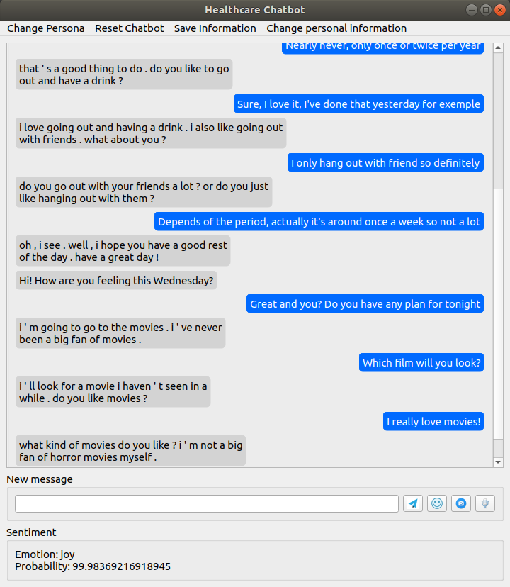

# Healthcare Chatbot

## Installing the chatbot

# Create a requirement.txt

After installing the modules, you need to change the torch_agent.py file in your parleai/core directory. If you don't do it, the chatbot will return an error with "from_db" inside
# Add a link to download final_model.bin

Then, you can run with the command:

python user_interface.py

## Chatbot with Parlai

In order to have the state of the art, we've used one [ParlAI](https://parl.ai/) and the model [Blender 90M](https://parl.ai/projects/recipes/) since it was quick to compute and really efficient.

In order to add some generic question, when the chatbot don't ask a question, 1 time out 5, we add one of the lines in generic_questions.txt at the end of the answer.

Possible improvement: In august 2020, BlendedSkillTalk was the state of the art for a chatbot (for the version 3B parameters). This will probably change soon and changing the model should be easy, see the function create_agent_and_persona in chatbot.py

Most of the fonction for the chatbot are in the file chatbot.py

## Memory

In order to make the chatbot remember what we want, we've changed the core/torch_agent.py function of parlai. With this, we've been able to store information and, when a sentence looks like the question we've stored, we automatically sent the answer. 

The questions and answers are stored in user_facts.csv.

To know if the question looks like one we've stored in the file, we use a [sentence_transformer](https://github.com/UKPLab/sentence-transformers#pretrained-models). Then, we compute the closest question in the file, and if it's superior to a threshold, we return the appropriate answer.

In order to let the user the freedom to store what he wants, we've put a button where he can edit the question and answer. After choosing to store, we transform the 'I, I'm etc' in 'you, you are' for the answer, and the opposite for the question in order to be closer when we compare the questions.

If the user wants to change the stored information, he can use the button change personal information. It works like the change persona button. An improvement for this window would be to add a scrollbar to this popup

Function: add_memory, change_saved_information

## Storing the message history and greetings

At each message from the user and the chatbot, we store it in the history.csv file. If the message is from the chatbot, we add the information C in the first row of the csv file, U otherwise.

Function: message_history, called in add_scrollbar_widget

When the user opens the application, the chatbot will automatically send greetings in order to start the conversation.

Function greetings in chatbot.py

#### On text with Bert

#### On image

For the facial emotion recognition, we've used the module [facial-emotion-recognition](https://pypi.org/project/facial-emotion-recognition/). We've changed the file facial_emotion_recognition.py in order to return what we want.

function: emotion_from_image

## Feature

#### Reset the chatbot

If the user wants to reset the chatbot, the user can do it by clicking on the button "Reset chatbot" on the menu.  If he does this, a confirmation popup will appear explaining what will append. If the user confirms that he wants to reset the chatbot, the history, the persona, and the user facts will be deleted, the blenderskillbot reset and the application will restart.

The button is added in the set_menu function

Function: reset_chatbot

#### Music depending of the emotion

When the user clicks on the emoji button, the chatbot will compute the emotion and depending on the result, a youtube music will be open according to the emotion.
The possible musics are stored in a file for every emotion. 

A way to improve the application would be to let the user add the musics and keep a default choice. 

Function: show_emotion_and_music

#### User Interface

All the element relative to the UI are present in the user_interface.py file. To create it, we've used PyQt5. It contains multiple widget:

* The menu, with the button about the persona, the personal information and reset the chatbot
* The message history, we've add a scrollbar so it's possible to see all the previous message
* The new message input and the buttosn for sending a message, getting music and the emotion, adding an image and having a call
* The sentiment and music displayer

#### Call the user

If the user wants to speak instead of texting with the chatbot, he can click on the microphone button. Then, the app will use his microphone to register what he said and use the google recognition api to compute it into text. After this, we send the text to the chatbot and transform the audio in an mp3 file and launch it.
All the conversations are stored in the history.csv file.

Function: chatbot_speaks, get_audio, chatting, process_audio

Possible improvement: Find a voice that sounds more human

#### Change the persona

If the user wants to change the persona, he can click on the "Change persona" button of the menu. If he does this, a popup with 5 text input will appear. The input will be filled with the lines in persona.txt

The number of persona is limited to 5 because parlai default parameters gives a limit of characters that corresponds to 6 or 7 sentences.

When the user change the persona, the affect are took in count only after the restart of the app since we need to reset the parlai chatbot and input the persona

The button is added in the function set_menu. 

Function: change_persona; set_persona

